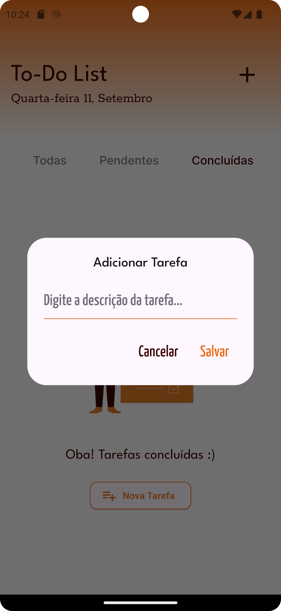

# TaskList - Gerenciador de Tarefas

## 💡 Sobre o Projeto

Este aplicativo foi desenvolvido como forma de aprendizado, utilizando uma API para gerenciar uma lista de tarefas (TaskList). O **TaskList** permite que os usuários cadastrem itens, marquem tarefas como concluídas, e visualizem as listas organizadas em três categorias diferentes: **todas as tarefas**, **tarefas pendentes**, e **tarefas concluídas**.

## 📱 Demonstração

Abaixo estão algumas telas do aplicativo:

<p align="center">
  
  
</p>

<p align="center">
  
  
</p>

- **Imagem 1**: Tela com todas as tarefas.
- **Imagem 2**: Exemplo de cadastro de nova tarefa.
- **Imagem 3**: Tela com as tarefas pendentes.
- **Imagem 4**: Tela com as tarefas concluídas.

## 🚀 Funcionalidades

- ✏️ Cadastro de novas tarefas.
- ✅ Marcar tarefas como concluídas.
- 🔄 Visualização organizada das tarefas em três telas: todas, pendentes e concluídas.
- 📋 Integração com API para persistência de dados.

## 🛠️ Tecnologias Utilizadas

- [Flutter](https://flutter.dev/) (Framework principal)
- [Dart](https://dart.dev/) (Linguagem de programação)
- [Dio](https://pub.dev/packages/dio) (Consumo de API)
- [GetX](https://pub.dev/packages/get) (Gerenciamento de estado)

## 🛠 Como Rodar o Projeto

Para rodar o projeto localmente, siga os seguintes passos:

1. Clone este repositório:
   ```bash
   git clone https://github.com/seu-usuario/tasklist-app.git
   
2. Acesse a pasta do projeto:
   ```bash
     cd payflow-app

3. Instale as dependências:
   ```bash
    flutter pub get

4.Execute o aplicativo:
   ```bash
    flutter run
